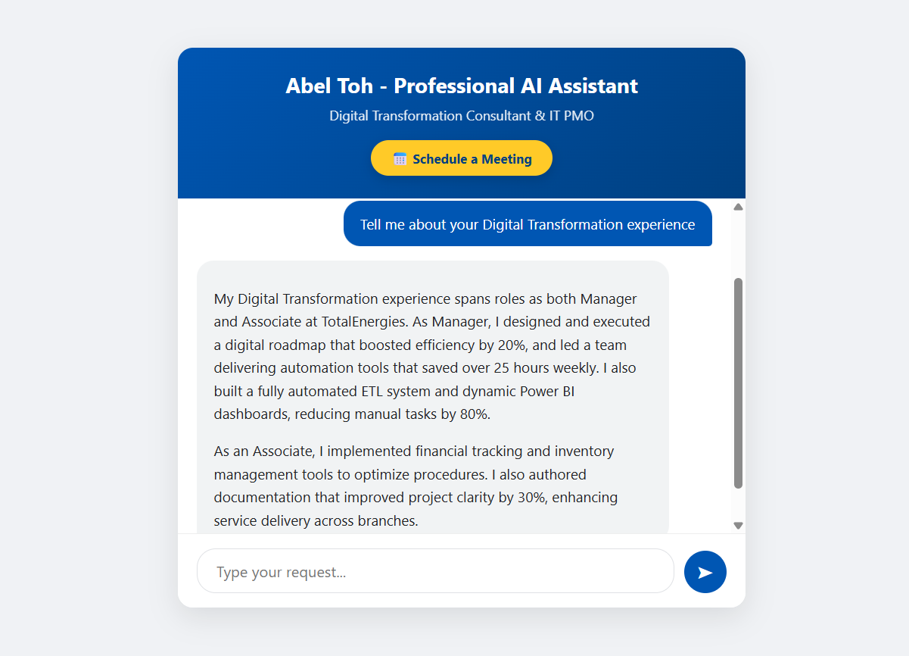
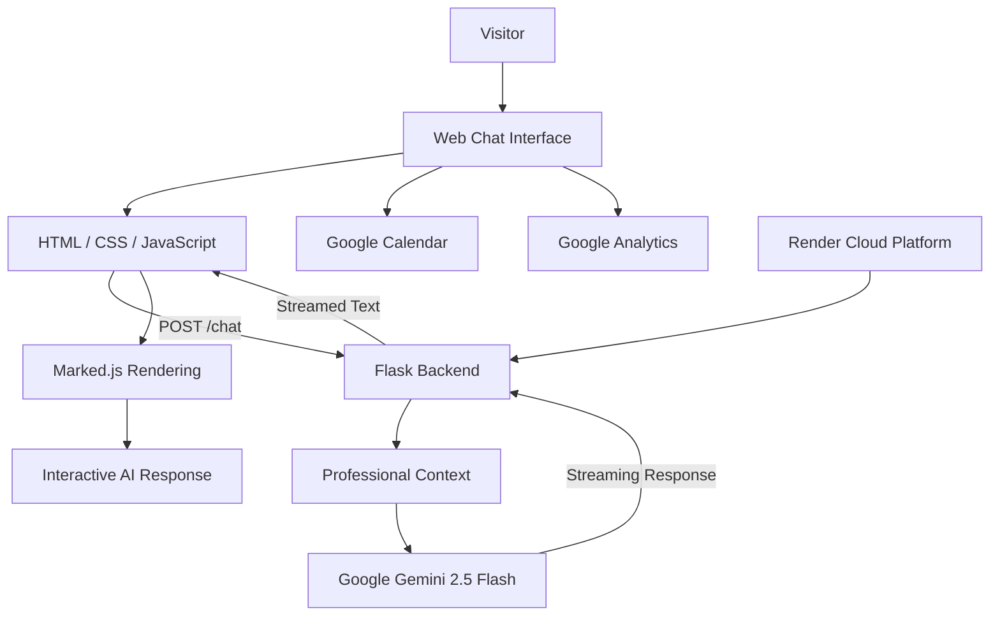

# Personal Agentic AI

### AI-Powered Professional Digital Twin

An interactive AI-powered professional assistant that allows recruiters, hiring managers, clients, and collaborators to explore **Abel Toh's professional experience, skills, certifications, and career background through conversation**.

Built with **Python, Flask, Google Gemini, Render, and Google Analytics**.

---

## 🖥️ Application Preview



---

## 🚀 Live Demo

The application is deployed publicly on **Render** and can be tested directly from the browser.

### 👉 [Launch the Professional AI Assistant](https://professional-ai-assistant.onrender.com/)

No installation is required to try the live version.

Visitors can interact with the assistant to explore topics such as:

- Digital Transformation
- IT Project Management
- Artificial Intelligence
- Automation
- Business Intelligence
- Project Governance
- Certifications
- Professional experience
- Career opportunities
- Collaboration

---

## 📌 About the Project

Traditional CVs and professional portfolios are static.

They require recruiters, hiring managers, potential clients, and collaborators to manually search through documents to understand someone's experience.

**Personal Agentic AI** explores a different approach:

> What if a professional portfolio could answer questions about itself?

The project creates an interactive **Professional AI Digital Twin** capable of answering questions about Abel Toh's career, skills, certifications, achievements, and professional background.

Instead of browsing through a traditional CV, users can simply ask questions.

For example:

```text
Tell me about your experience in Digital Transformation.
```

```text
What is your current role as an IT PMO?
```

```text
What automation projects have you worked on?
```

```text
What AI skills and certifications do you have?
```

The assistant responds conversationally using professional context supplied to **Google Gemini 2.5 Flash**.

---

## ✨ Key Features

### 🤖 Professional AI Digital Twin

The assistant represents Abel Toh's professional profile and answers questions about:

- Career history
- Digital Transformation
- IT Project Management
- AI and automation
- Data analytics
- Technical expertise
- Certifications
- Professional achievements
- Career interests
- Contact information

The assistant responds in the first person to create a natural conversational professional profile.

---

### 🧠 Google Gemini Integration

The backend uses **Google Gemini 2.5 Flash** to generate contextual responses based on the visitor's questions and the professional knowledge provided to the model.

---

### ⚡ Streaming AI Responses

Gemini responses are streamed through the Flask backend.

This means the user begins seeing the response while it is still being generated instead of waiting for the entire answer to complete.

---

### ⌨️ Natural Typing Experience

The frontend progressively displays streamed content character by character, creating a more natural conversational experience.

---

### 📝 Markdown Rendering

AI responses are rendered using **Marked.js**, allowing the assistant to return structured content including:

- Paragraphs
- Bullet points
- Numbered lists
- Bold text
- Formatted explanations

---

### 💬 Quick Questions

The interface contains predefined prompts that allow visitors to immediately explore important areas of the professional profile.

Current quick actions include:

- 💼 IT PMO Role
- 🔄 Digital Transformation
- 📞 Contact Information

---

### 📅 Meeting Scheduling

The application includes a direct **Google Calendar** scheduling option.

Visitors interested in discussing professional opportunities or collaboration can access the scheduling functionality directly from the application.

---

### 📊 Google Analytics

The live application is integrated with **Google Analytics** to monitor user engagement.

Analytics can provide insight into:

- Active users
- Page views
- Real-time traffic
- Visitor engagement
- Usage patterns

This helps evaluate how visitors interact with the Professional AI Digital Twin and provides data that can guide future improvements.

---

## 🏗️ Architecture



---

## 🔄 How It Works

### 1. Visitor submits a question

A user enters a question through the web-based chat interface.

---

### 2. The frontend sends the request

JavaScript sends the user's message to the Flask backend using:

```text
POST /chat
```

---

### 3. Flask receives the question

The Flask application validates the incoming request and passes the user's message to the Gemini conversation.

---

### 4. Professional context guides the AI

Gemini receives professional context describing Abel Toh's:

- Career experience
- Professional achievements
- Certifications
- Technical expertise
- Digital Transformation background
- IT PMO experience
- AI capabilities
- Languages
- Professional interests

This context guides the assistant's responses.

---

### 5. Gemini generates the answer

The application uses:

```text
Gemini 2.5 Flash
```

to generate the response.

---

### 6. The response is streamed

Instead of waiting for the full answer to finish generating, Flask streams the response back to the browser.

---

### 7. The frontend renders the result

JavaScript progressively displays the streamed response.

**Marked.js** converts Markdown content into formatted HTML as the response appears.

---

## 🛠️ Tech Stack

| Layer | Technology |
|---|---|
| Programming Language | Python |
| Backend Framework | Flask |
| AI Model | Google Gemini 2.5 Flash |
| AI SDK | Google Generative AI Python SDK |
| Frontend | HTML5 |
| Styling | CSS3 |
| Client Logic | JavaScript |
| Markdown Rendering | Marked.js |
| HTTP Communication | Fetch API |
| Response Delivery | Streaming |
| Cross-Origin Support | Flask-CORS |
| Production Server | Gunicorn |
| Cloud Hosting | Render |
| Analytics | Google Analytics |
| Scheduling | Google Calendar |
| Version Control | Git |
| Repository Hosting | GitHub |

---

## 📂 Project Structure

```text
Personal-Agentic-AI/
│
├── app.py
├── requirements.txt
│
└── templates/
    └── index.html
```

### `app.py`

Contains:

- Flask application configuration
- Gemini API configuration
- Professional AI context
- Gemini model initialization
- Chat endpoint
- Streaming response generator
- Error handling

---

### `templates/index.html`

Contains:

- Chat interface
- Application styling
- Quick action buttons
- Google Calendar scheduling link
- Google Analytics integration
- Message input
- Streaming response handling
- Markdown rendering
- Natural typing effect

---

### `requirements.txt`

Contains the Python packages required to run and deploy the application.

---

## 🌐 Live Production Version

You do not need to install the project locally to test it.

The application is deployed on **Render**.

### 👉 [Open the Live Professional AI Assistant](https://professional-ai-assistant.onrender.com/)

---

## ☁️ Deployment

The production application is hosted on:

**Render**

The Flask application uses **Gunicorn** as its production WSGI server.

A standard production start command is:

```bash
gunicorn app:app
```

The production environment must contain:

```text
GEMINI_API_KEY
```

The Gemini API key should be configured through Render's environment-variable configuration rather than stored in the repository.

---

## 📊 Analytics & User Engagement

Google Analytics is integrated into the frontend to help understand how visitors use the application.

The analytics implementation can provide visibility into:

- Number of visitors
- Active users
- Page views
- Real-time usage
- Engagement patterns
- Traffic trends

This provides a feedback loop for improving the Professional AI Digital Twin based on actual usage.

The private Google Analytics administration dashboard is intentionally not linked from this repository.

---

## 💬 Example Questions

Try asking the digital twin:

```text
Tell me about your role as an IT PMO.
```

```text
Tell me about your Digital Transformation experience.
```

```text
What automation projects have you delivered?
```

```text
What are your AI skills?
```

```text
What certifications do you have?
```

```text
How do you approach project governance?
```

```text
What technologies do you work with?
```

```text
Are you open to new opportunities?
```

```text
How can I contact you?
```

---

## 🎯 Professional Focus

The assistant currently represents experience across several professional areas.

### Digital Transformation

Experience designing and implementing digital initiatives, automation solutions, analytics tools, and workflow improvements.

---

### IT Project Management

Experience supporting project lifecycle governance, financial oversight, resource allocation, cross-functional coordination, and project delivery.

---

### Automation

Experience working with technologies including:

- Python
- PowerShell
- Power Automate
- SQL

with the objective of reducing manual processes and improving operational efficiency.

---

### Data & Business Intelligence

Experience working with technologies including:

- Power BI
- SQL
- Dataverse
- QlikView
- ETL pipelines
- KPI reporting
- Data visualization

---

### Artificial Intelligence

Professional development and practical interest in areas including:

- Generative AI
- AI-powered automation
- Agentic AI
- Retrieval-Augmented Generation
- AI transformation
- Intelligent workflow design

---

## 📈 Career Impact Represented by the Assistant

The professional context supplied to the AI includes achievements such as:

- Leading Digital Transformation initiatives
- Scaling digital solutions from pilot to enterprise use
- Delivering automation that saved more than 25 hours of manual work per week
- Building automated ETL and Power BI solutions
- Reducing manual activities through automation
- Supporting project governance and financial management
- Coordinating onsite and offshore teams
- Working across Digital Transformation, IT PMO, analytics, and automation

---

## 🎨 Current Interface

The application uses a lightweight conversational interface designed to keep the visitor focused on interaction with the AI.

```text
┌─────────────────────────────────────┐
│ Abel Toh - Professional AI Assistant│
│ Digital Transformation & IT PMO     │
│                                     │
│        📅 Schedule a Meeting        │
├─────────────────────────────────────┤
│                                     │
│         Conversation Area           │
│                                     │
│  AI responses stream progressively  │
│                                     │
├─────────────────────────────────────┤
│ 💼 IT PMO                           │
│ 🔄 Digital Transformation           │
│ 📞 Contact Info                     │
├─────────────────────────────────────┤
│ Type your request...              ➤ │
└─────────────────────────────────────┘
```

---

## 🔐 Security

The Gemini API key is not hardcoded into the Python application.

The backend retrieves the key using:

```python
os.environ["GEMINI_API_KEY"]
```

API credentials should always be stored as environment variables or managed through the deployment platform's secret-management functionality.

Sensitive credentials should never be committed to the repository.

---

## ⚠️ Current Limitations

The current version is primarily a **Professional AI Digital Twin prototype**.

It is not yet a fully autonomous agentic system.

Current architectural limitations include:

- Conversation state is currently maintained in memory
- Conversation isolation between multiple simultaneous visitors needs improvement
- Professional knowledge is currently embedded directly in application code
- No external vector database is currently used
- No Retrieval-Augmented Generation pipeline is currently implemented
- No autonomous tool-selection framework is currently implemented
- Automated test coverage is still to be added
- Backend architecture can be further modularized

These areas are part of the planned evolution of the project.

---

## 🗺️ Roadmap

### Phase 1 — Professional Digital Twin

- [x] Gemini-powered professional assistant
- [x] Professional knowledge context
- [x] Web-based conversational interface
- [x] Streaming AI responses
- [x] Markdown rendering
- [x] Quick professional prompts
- [x] Google Calendar integration
- [x] Google Analytics integration
- [x] Public cloud deployment on Render
- [x] Production serving with Gunicorn

---

### Phase 2 — Architecture Improvements

- [ ] Independent conversation sessions per visitor
- [ ] Separate professional knowledge from application logic
- [ ] Improved environment configuration
- [ ] Modular backend structure
- [ ] Improved exception handling
- [ ] Structured logging
- [ ] Automated tests
- [ ] Gemini SDK modernization

---

### Phase 3 — Knowledge & RAG

- [ ] External professional knowledge base
- [ ] CV and document ingestion
- [ ] Embeddings
- [ ] Semantic search
- [ ] Vector database
- [ ] Retrieval-Augmented Generation
- [ ] Source-grounded answers

---

### Phase 4 — Agentic AI

- [ ] Tool calling
- [ ] Multi-step planning
- [ ] Autonomous workflow execution
- [ ] External service integrations
- [ ] Context-aware actions
- [ ] Task orchestration

The long-term goal is to evolve the Professional Digital Twin into a more capable **Personal Agentic AI system**.

---

## 💡 Why I Built This

A traditional CV tells people what someone has done.

An AI-powered professional digital twin allows them to **ask**.

This project explores how Generative AI can transform a static professional portfolio into an interactive experience.

Instead of simply displaying information, the portfolio becomes conversational.

It allows recruiters, hiring managers, collaborators, and potential clients to explore professional experience according to what matters most to them.

The project also serves as a practical exploration of:

- Generative AI
- AI application development
- Digital Transformation
- Human-AI interaction
- Cloud deployment
- User analytics
- Conversational interfaces
- Future agentic architectures

---

## 🌍 Potential Use Cases

The concept behind this project could be adapted for:

- AI-powered professional portfolios
- Interactive CVs
- Recruitment assistants
- Consultant profiles
- Executive digital twins
- Employee knowledge assistants
- Internal subject-matter experts
- Customer-facing knowledge assistants
- Personal knowledge systems
- AI-powered company profiles

---

## 👤 Author

### Abel Toh

**Digital Transformation Consultant & IT PMO**

Professional focus:

- Digital Transformation
- IT Project Management
- Artificial Intelligence
- Automation
- Business Intelligence
- Data Analytics
- Process Optimization
- Project Governance

---

## 🤝 Connect

Interested in discussing:

- Digital Transformation
- AI
- Automation
- IT Project Management
- Data Analytics
- Business Intelligence
- Professional opportunities
- Collaboration

Use the **Schedule a Meeting** option directly inside the live application.

### 👉 [Launch the Professional AI Assistant](https://professional-ai-assistant.onrender.com/)

---

## 🤝 Contributing

This repository currently represents a personal professional portfolio and AI development project.

Constructive feedback, ideas, and suggestions are welcome.

If you identify an issue or would like to suggest an improvement, feel free to open a GitHub issue.

---

## 📄 License

A license has not yet been added to this repository.

An appropriate open-source license can be added if the project is opened for broader reuse or contribution in the future.

---

## ⚠️ Disclaimer

This application uses Generative AI.

Although the assistant is designed to answer questions based on supplied professional information, AI-generated responses may occasionally be incomplete or inaccurate.

For formal verification of employment history, professional qualifications, certifications, or other important information, please contact Abel Toh directly.

---

## ⭐ Support the Project

If you find the concept interesting, consider starring the repository.

### 🚀 [Try the Live Demo](https://professional-ai-assistant.onrender.com/)
