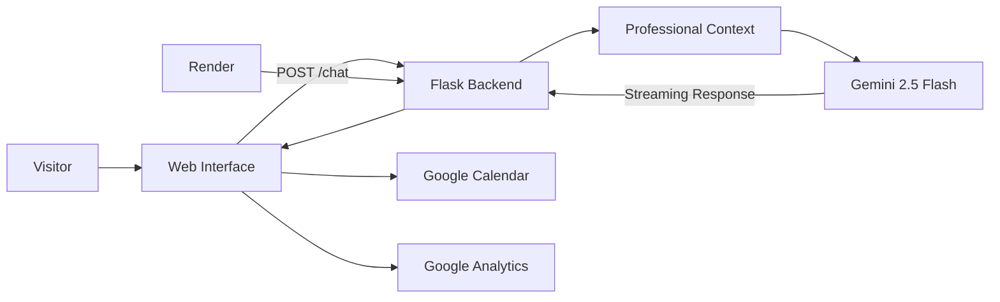

# Personal Agentic AI

### AI-Powered Professional Digital Twin

An interactive AI portfolio that lets recruiters, hiring managers, clients, and collaborators explore **Abel Toh's professional experience, skills, certifications, and career background through natural-language conversation**.

Built with **Python, Flask, Google Gemini, Render, and Google Analytics**.

### 🚀 [Try the Live Demo](https://professional-ai-assistant.onrender.com/)

---

## 🖥️ Preview


---

## About

Traditional CVs are static.

This project explores a more interactive approach: a professional profile that can **answer questions about itself**.

The application acts as a professional AI digital twin, allowing visitors to ask about areas such as:

- Digital Transformation
- IT Project Management
- AI and Automation
- Data Analytics
- Project Governance
- Certifications
- Professional achievements
- Career opportunities

The assistant uses **Google Gemini 2.5 Flash** and a structured professional context to generate concise, relevant responses in real time.

---

## Key Features

- 🤖 **Professional AI Digital Twin** — conversational access to career experience, skills, and achievements
- 🧠 **Gemini 2.5 Flash** — AI-powered contextual responses
- ⚡ **Streaming Responses** — answers appear progressively as they are generated
- 📝 **Markdown Rendering** — structured and readable AI responses
- 💬 **Quick Prompts** — instant access to key professional topics
- 📅 **Google Calendar Integration** — direct meeting scheduling
- 📊 **Google Analytics** — tracks live user engagement and usage patterns
- ☁️ **Render Deployment** — publicly accessible production application
- 🔐 **Environment-Based Secrets** — Gemini credentials are kept outside the source code

---

## Architecture



### Request Flow

1. A visitor submits a question through the web interface.
2. JavaScript sends the request to the Flask `/chat` endpoint.
3. The backend passes the question to Gemini with the professional context.
4. Gemini generates the answer.
5. Flask streams the response back to the browser.
6. The frontend progressively renders the response using Markdown.

---

## Tech Stack

| Area | Technology |
|---|---|
| Language | Python |
| Backend | Flask |
| AI Model | Google Gemini 2.5 Flash |
| AI Integration | Google Generative AI SDK |
| Frontend | HTML, CSS, JavaScript |
| Markdown | Marked.js |
| Response Delivery | Streaming |
| Production Server | Gunicorn |
| Hosting | Render |
| Analytics | Google Analytics |
| Scheduling | Google Calendar |
| Version Control | Git / GitHub |

---

## Professional Context

The digital twin represents experience across:

### Digital Transformation
Enterprise automation, workflow optimization, analytics, and digital transformation initiatives.

### IT Project Management
Project lifecycle governance, resource coordination, financial oversight, delivery tracking, and hybrid Agile/Waterfall environments.

### Automation
Experience using technologies such as:

- Python
- PowerShell
- Power Automate
- SQL

### Data & Business Intelligence

Experience with:

- Power BI
- SQL
- Dataverse
- QlikView
- ETL pipelines
- KPI reporting
- Data visualization

### Artificial Intelligence

Professional focus includes:

- Generative AI
- AI-powered automation
- Agentic AI
- Retrieval-Augmented Generation
- AI transformation

---

## Selected Professional Impact

The knowledge context provided to the assistant includes achievements such as:

- Led Digital Transformation initiatives that improved operational efficiency by **20%**
- Delivered automation solutions saving **25+ hours of manual work per week**
- Built automated ETL and Power BI solutions that reduced manual activities by **80%**
- Coordinated onsite and offshore teams across multiple locations
- Supported project governance, financial management, and delivery oversight
- Worked across Digital Transformation, IT PMO, automation, analytics, and AI

---

## Project Structure

```text
Personal-Agentic-AI/
│
├── assets/
│   └── demo.png
│
├── templates/
│   └── index.html
│
├── .env.example
├── .gitignore
├── app.py
├── requirements.txt
└── README.md
```

### `app.py`

Contains the:

- Flask application
- Gemini configuration
- Professional knowledge context
- `/chat` endpoint
- Streaming response logic
- Error handling

### `templates/index.html`

Contains the:

- Chat interface
- Styling
- Quick prompts
- Google Calendar link
- Google Analytics integration
- Streaming frontend logic
- Markdown rendering

---

## Run Locally

### 1. Clone the repository

```bash
git clone https://github.com/Abel-lab-dot/Personal-Agentic-AI.git
cd Personal-Agentic-AI
```

### 2. Create a virtual environment

Linux / macOS:

```bash
python3 -m venv .venv
source .venv/bin/activate
```

Windows:

```bash
python -m venv .venv
.venv\Scripts\activate
```

### 3. Install dependencies

```bash
pip install -r requirements.txt
```

### 4. Configure Gemini

Create your environment variable:

Linux / macOS:

```bash
export GEMINI_API_KEY="your_api_key_here"
```

Windows PowerShell:

```powershell
$env:GEMINI_API_KEY="your_api_key_here"
```

Never commit a real API key to GitHub.

### 5. Start the application

```bash
python app.py
```

Then open:

```text
http://localhost:5000
```

---

## Production Deployment

The live application is hosted on **Render** and served with **Gunicorn**.

```bash
gunicorn app:app
```

### Live Application

**https://professional-ai-assistant.onrender.com/**

The production Gemini API key is configured as a secure environment variable on the hosting platform.

---

## Analytics

The production application uses **Google Analytics** to understand how visitors interact with the digital twin.

Tracked engagement can include:

- Active users
- Page views
- Real-time usage
- Traffic trends
- Engagement patterns

Analytics data helps guide future improvements to the user experience.

---

## Example Questions

Try asking:

```text
Tell me about your Digital Transformation experience.
```

```text
What is your current role as an IT PMO?
```

```text
What automation projects have you delivered?
```

```text
What are your AI skills and certifications?
```

```text
How do you approach project governance?
```

```text
Are you open to new opportunities?
```

---

## Current Status

The current release is a **Professional AI Digital Twin**, not yet a fully autonomous agentic system.

Current capabilities focus on:

- Conversational professional discovery
- Gemini-powered responses
- Streaming interaction
- Professional context
- Analytics
- Scheduling
- Cloud deployment

Future development will expand the system toward more advanced agentic capabilities.

---

## Roadmap

- [x] Professional Gemini-powered assistant
- [x] Streaming responses
- [x] Public Render deployment
- [x] Google Analytics integration
- [x] Google Calendar integration
- [x] Professional knowledge context
- [ ] Independent conversation sessions per visitor
- [ ] External knowledge base
- [ ] Retrieval-Augmented Generation
- [ ] Vector search
- [ ] Tool calling
- [ ] Multi-step planning
- [ ] Automated testing
- [ ] More modular backend architecture

---

## Why I Built It

A traditional CV tells people what someone has done.

A professional digital twin allows them to **ask**.

This project demonstrates how Generative AI can turn a static professional portfolio into an interactive experience while combining:

- AI application development
- Digital Transformation
- Cloud deployment
- Conversational UX
- Analytics
- Professional knowledge representation

---

## Author

### Abel Toh

**Digital Transformation Consultant & IT PMO**

Focus areas:

`Digital Transformation` · `IT Project Management` · `Artificial Intelligence` · `Automation` · `Business Intelligence` · `Data Analytics` · `Project Governance`

---

## Connect

Interested in AI, Digital Transformation, automation, IT Project Management, or collaboration?

### 👉 [Launch the Professional AI Assistant](https://professional-ai-assistant.onrender.com/)

You can also use the **Schedule a Meeting** option directly inside the application.

---

## Disclaimer

This application uses Generative AI.

AI-generated responses may occasionally be incomplete or inaccurate. For formal verification of professional experience, employment history, or certifications, please contact Abel Toh directly.

---

⭐ **If you find the project interesting, consider starring the repository.**
